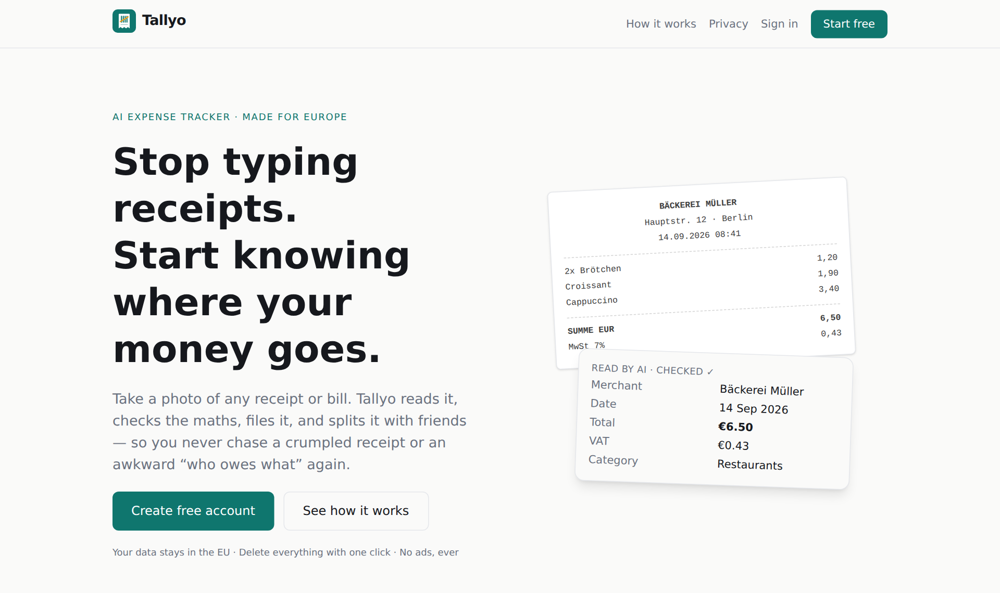
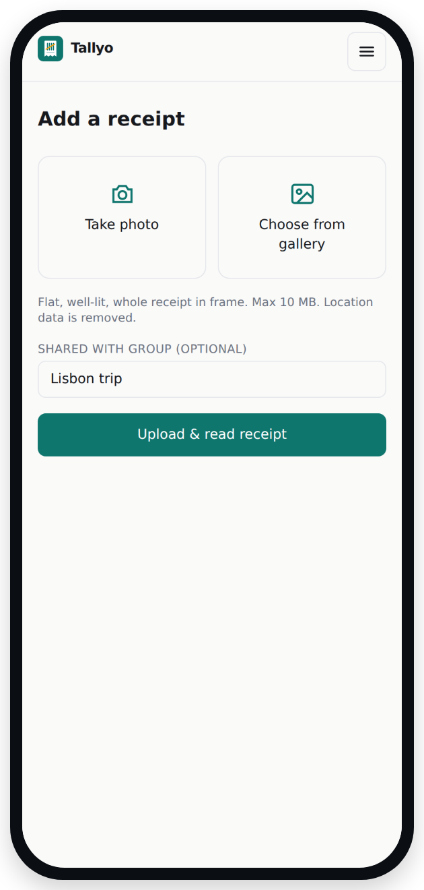
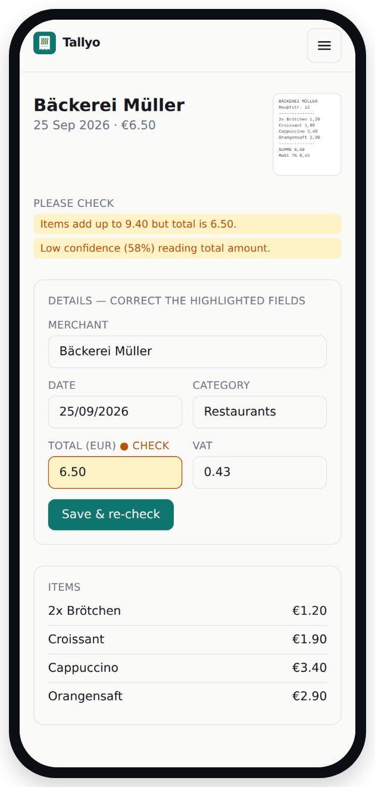
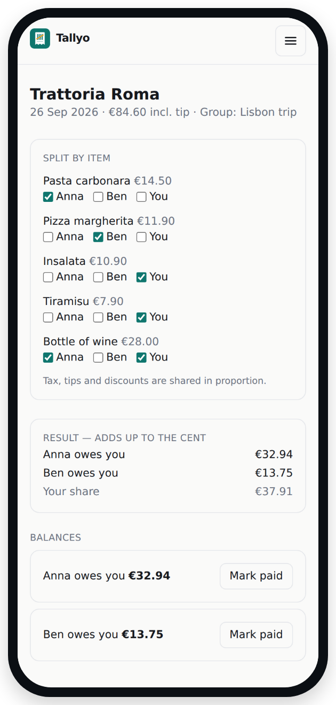
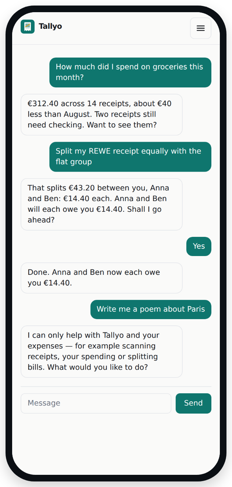
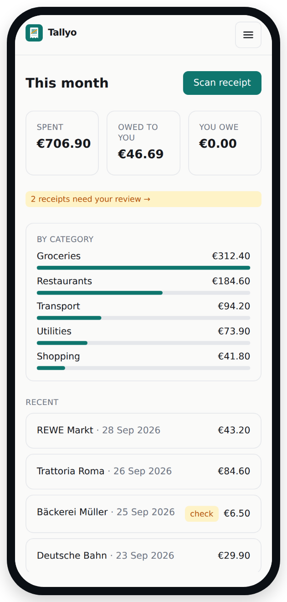
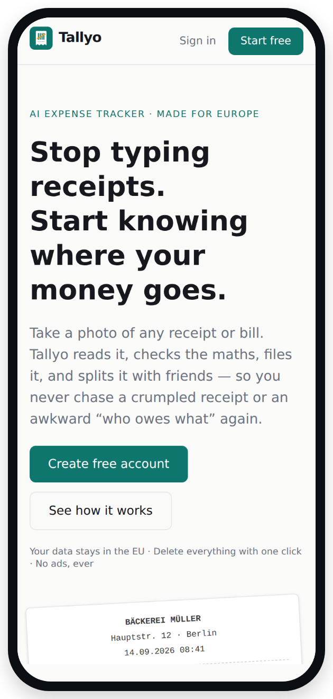

  

<h1 align="center">Tallyo</h1>

  <b>Snap a receipt. Tallyo does the rest.</b> 
  An AI expense tracker for Europe that reads your receipts, catches mistakes and splits bills fairly.

  <a href="https://tayllo-web.vercel.app/"><b>🌐 Try it in your browser</b></a>
  &nbsp;·&nbsp;
  <a href="https://github.com/mtauqeer248/Tayllo/releases"><b>📱 Download for Android</b></a>
  &nbsp;·&nbsp;
  <a href="#-how-to-install-the-android-app">How to install</a>
  &nbsp;·&nbsp;
  <a href="#-how-it-works">How it works</a>
  &nbsp;·&nbsp;
  <a href="#-privacy">Privacy</a>

  

---

## 🧾 The problem

Receipts are small, but the hassle isn't.

- **Paper piles up.** Receipts fade, get lost in pockets, or end up in a shoebox you only open at tax time.
- **Typing is tedious.** Copying the shop, date, VAT and every item into a spreadsheet takes minutes per receipt, and mistakes slip in.
- **Splitting is awkward.** After a dinner, a trip or a month of shared groceries, working out *who owes whom* is slow and easy to get wrong.

**Tallyo turns a photo of a receipt into clean, checked and shareable expense data in seconds.**

---

## ✨ How it works

<table>
  <tr>
    <td align="center" width="33%"></td>
    <td align="center" width="33%"></td>
    <td align="center" width="33%"></td>
  </tr>
  <tr>
    <td valign="top"><b>1. Snap or pick a photo</b> Take a new photo of a receipt or bill, or choose one that's already in your gallery.</td>
    <td valign="top"><b>2. AI reads it, and Tallyo checks it</b> The shop, date, total, VAT and every item are filled in for you. Anything that doesn't add up is highlighted, so you can fix it in one tap.</td>
    <td valign="top"><b>3. Split and track</b> Share the bill with friends equally, by item, or with custom amounts. It always adds up to the cent.</td>
  </tr>
</table>

---

## 🤖 How AI makes life easier

### It reads receipts the way a person would

You don't need to type anything. Tallyo understands different receipt layouts, languages and number formats from across Europe, such as `12,50 €`, `€12.50`, *MwSt*, *TVA*, *IVA* and *BTW*.

### It never blindly trusts itself

The AI reads the receipt, and then Tallyo **double-checks the numbers**:

- Do the items add up to the total?
- Is the VAT realistic? The highest EU rate is 27%.
- Is the date possible?
- Was the photo clear enough to read?

If something looks wrong, that field is **highlighted in yellow** so you can check it. Nothing is final until you're happy with it.

### It splits bills fairly

Tallyo can split a bill **by item**, so whoever had the pasta pays for the pasta. Tax and tips are shared in proportion, and the shares always add up exactly. Your balances then show who owes whom, and you can mark debts as paid.

### An assistant that knows your expenses

<table>
  <tr>
    <td width="50%"></td>
    <td valign="top">
      Just ask, in your own words:
      <ul>
        <li><i>"How much did I spend on groceries this month?"</i></li>
        <li><i>"Which receipts need checking?"</i></li>
        <li><i>"Split my last receipt with the flat group."</i></li>
        <li><i>"Who owes me money?"</i></li>
      </ul>
      The assistant can use every feature of the app, but it <b>always asks before changing anything</b>. It sticks to your expenses: it won't answer unrelated questions.
    </td>
  </tr>
</table>

### See where your money goes

<table>
  <tr>
    <td width="50%"></td>
    <td valign="top">
      Your home screen shows at a glance:
      <ul>
        <li>What you spent this month, and on which categories</li>
        <li>How much friends owe you, and how much you owe</li>
        <li>Receipts that still need a quick check</li>
      </ul>
      You can also connect your bank (optional, read-only) to match card payments with receipts automatically, and see payments that are missing a receipt.
    </td>
  </tr>
</table>

---

## 👥 Who it's for

| | |
|---|---|
| 🏠 **Flatmates** | Share groceries and bills without a spreadsheet. |
| ✈️ **Travellers** | Split a trip's costs fairly, in any EU currency. |
| 💼 **Freelancers** | Keep VAT-ready records of every business expense. |
| 👨‍👩‍👧 **Families** | See where the monthly budget actually goes. |

---

## 🔒 Privacy

Your financial data deserves European standards.

- **Stored in the EU:** the database, files and servers are in Frankfurt, Germany.
- **Only you see your data:** strict per-user access rules. Groups only see what you share with them.
- **Your rights, built in:** download all your data or delete your account yourself, any time, from *Settings*.
- **Photos are cleaned:** location data is removed from every photo. The AI provider does not keep your images.
- **Read-only banking:** bank access is optional, regulated under PSD2, cannot move money, and expires after 90 days.
- **No ads and no trackers:** your data is never used for advertising.

---

## 📱 How to install the Android app

<table>
  <tr>
    <td width="40%"></td>
    <td valign="top">
      <ol>
        <li>On your <b>Android phone</b>, open the <a href="https://github.com/mtauqeer248/Tayllo/releases"><b>Releases page</b></a> and tap <b>tallyo.apk</b> under the newest version to download it.</li>
        <li>Open the downloaded file. If Android asks, allow your browser to <b>install unknown apps</b>, then go back.</li>
        <li>Tap <b>Install</b>. If Google Play Protect shows a warning, tap <b>More details → Install anyway</b>. The warning appears because this is an early version that isn't on the Play Store yet.</li>
        <li>Open <b>Tallyo</b>, tap <b>Start free</b>, create your account and confirm your email.</li>
        <li>Tap <b>Scan</b>, then take a photo or choose one from your gallery. That's it.</li>
      </ol>
      <b>iPhone?</b> Open <a href="https://tayllo-web.vercel.app/">tayllo-web.vercel.app</a> in Safari and tap <b>Share → Add to Home Screen</b>.  
      The app needs an internet connection.
    </td>
  </tr>
</table>

---

## ❓ FAQ

<b>What if the AI reads something wrong?</b>

 
That's exactly why Tallyo double-checks every receipt. Suspicious values are highlighted, and nothing is final until you confirm it. Every correction is saved in the receipt's history.

<b>Which receipts and countries work?</b>

 
Printed receipts, invoices and bills from across Europe, in the common EU languages and currencies. Clear, flat and well-lit photos work best.

<b>Do my friends need an account to split with me?</b>

 
Yes. To protect their privacy, Tallyo doesn't store data about people who haven't signed up. Creating a free account takes about a minute.

<b>Do I have to connect my bank?</b>

 
No. Bank matching is optional, and everything else works without it.

<b>How do I delete my data?</b>

 
Open <i>Settings → Delete everything</i>. Your account, receipts, photos, splits and bank data are permanently erased.

---

## 🛠️ For developers

Tallyo is a full-stack TypeScript project: a server-rendered Next.js app, three microservices (OCR, ledger and the AI assistant), a Supabase (PostgreSQL) database in the EU, Groq Llama models for AI, and a Capacitor Android app.

➡️ **Setup, architecture and deployment:** [`expense-scanner/README.md`](expense-scanner/README.md) 
➡️ **Architecture and GDPR design:** [`expense-scanner/docs/architecture.md`](expense-scanner/docs/architecture.md) 
➡️ **Development journey and decisions:** [`expense-scanner/docs/journey.md`](expense-scanner/docs/journey.md)

---

  Tallyo is an early version (v0.1). Feedback is very welcome, so please <a href="https://github.com/mtauqeer248/Tayllo/issues">open an issue</a>. 
  Screenshots show sample data.

